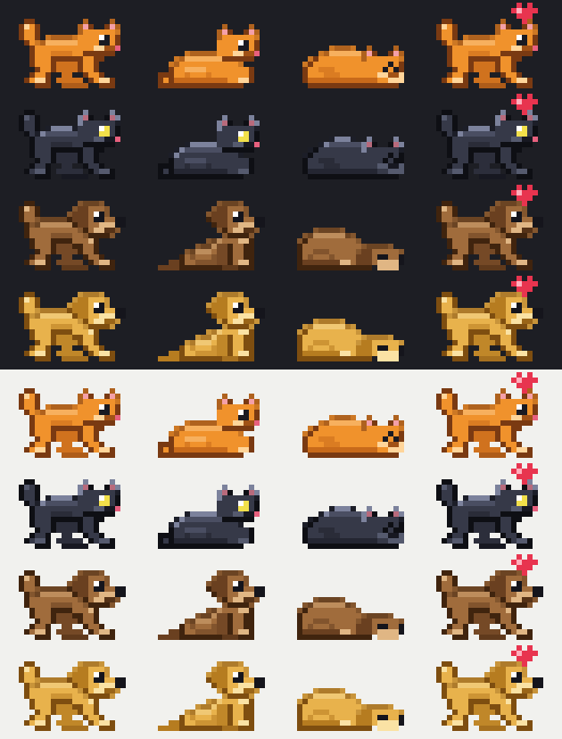

# claude-pets


Pixel-art cats and dogs that wander around above your Claude Code prompt. Inspired by [vscode-pets](https://github.com/tonybaloney/vscode-pets).



## Install

```
/plugin marketplace add e-newton/claude-pets
/plugin install pets@claude-pets
```

You start with one cat. The pets live in an 8-row band above the prompt, in the terminal version of Claude Code only.

## Commands

| Command | What it does |
| --- | --- |
| `/pet add <cat\|dog> [color] [name]` | Adopt a pet. Color and name are random if you leave them out. Up to 6 pets. |
| `/pet remove <name>` | Remove a pet. |
| `/pet clear` | Remove all of them. |
| `/pet list` | List your pets. |
| `/pet pat [name]` | Pat a pet and a heart pops up. |
| `/pet hide` / `/pet show` | Hide or show the band. |

Cats come in orange, black, gray and white. Dogs come in brown, golden, black and white. Your pets are saved between sessions.

## What they do

Pets walk back and forth and sit down now and then (cats sit like a loaf). While Claude is working they run. After two minutes with nothing going on they fall asleep.

## Development

The plugin lives in `plugins/pets/`. The art is drawn in code as character grids in `hooks/cat.ts` and `hooks/dog.ts`, with colors in `hooks/palettes.ts`.

```
claude plugin validate plugins/pets   # check the manifest and hooks
claude plugin test plugins/pets       # run the tests
python3 scripts/contact-sheet.py sheet.png 6   # render every pet and pose to a PNG
```

To try changes live, run `claude --plugin-dir plugins/pets`.

### Linting and formatting

TypeScript is linted and formatted with [Biome](https://biomejs.dev), and the Python script with [Ruff](https://docs.astral.sh/ruff/). The plugin itself has no dependencies. `package.json` only holds these dev tools.

```
npm install
npm run lint        # Biome lint + format check
npm run fix         # apply Biome fixes and formatting
npm run typecheck   # tsc; needs the types Claude Code writes to plugins/pets/.claude-plugin/types/
uvx ruff check scripts && uvx ruff format scripts
```

The pixel-art files (`cat.ts`, `dog.ts`, `legs.ts`, `palettes.ts`) are excluded from formatting so the hand-aligned grids keep their shape. They are still linted.

CI (`.github/workflows/ci.yml`) runs Biome, Ruff, `claude plugin validate --strict` and `claude plugin test` on every push and pull request.

## License

MIT
